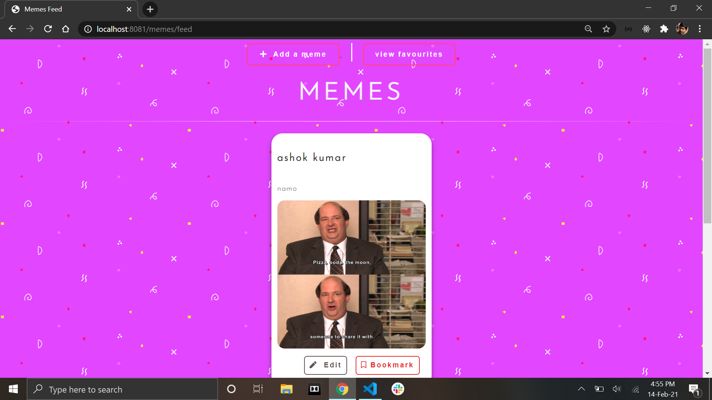
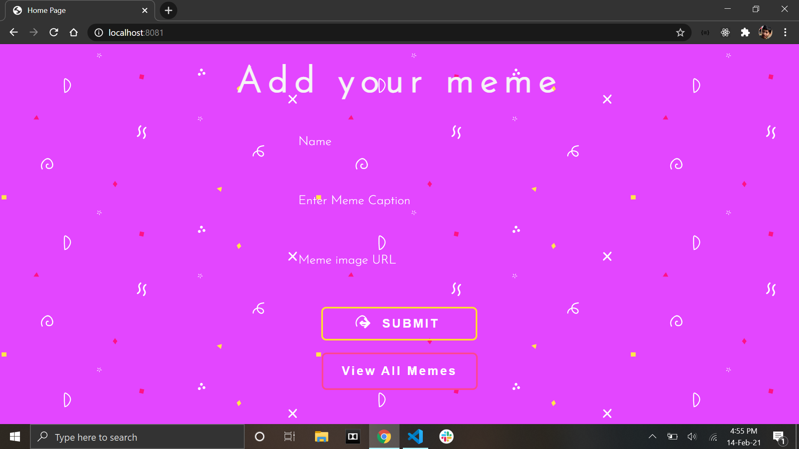
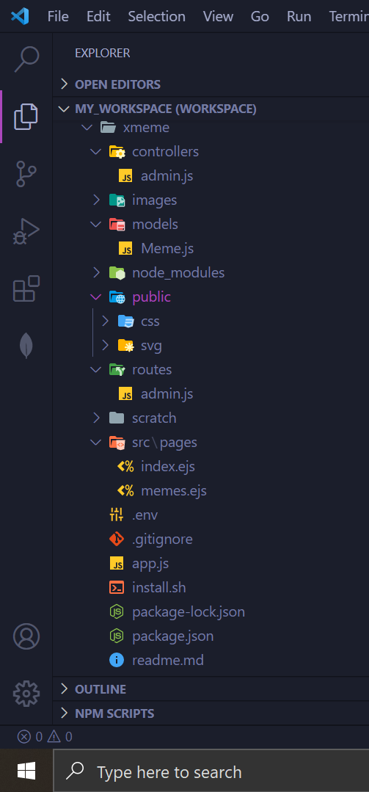
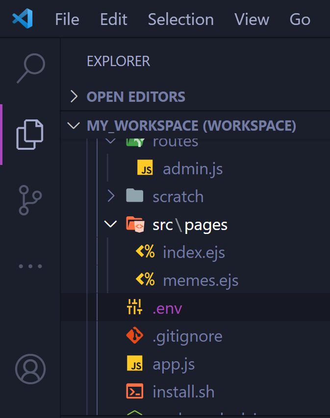

# XMeme App
> A simple site where you can browse through endless number of memes,bookmark your favourite meme and also post your own meme!

## Table of contents
* [General info](#general-info)
* [Screenshots](#screenshots)
* [Technologies](#technologies)
* [Setup](#setup)
* [Structure](#structure)
* [Note](#note)
* [Features](#features)

## General info
The project is built entirely on html,css and vanilla js on the frontend and
node.js on the backend.Done as a part of Crio's Winter of Doing(stage II).

## Screenshots
The Project contains mainly two pages.viz.

### Memes feed page
This is where you can view all existing memes.



### Add/Edit Meme page
This is where you can view the form for adding/editing a particular meme.


## Technologies
* HTML 
* CSS 
* Javascript 
* Node.js 
* ExpressJS 
* MongoDB 

## Setup
To run this on your local machine,simply clone the repo and "cd" into the directory:
```
cd kaustav123-kb-ME_BUILDOUT_XMEME
```

then run the "test_server.sh" file in the root directory:
```
chmod +x test_server.sh

./test_server.sh
```
this will install all necessary dependencies and get your server up and running.

yaay! project setup is complete...simply visit "http://localhost:8081" on your browser.

## Structure
The project has the following structure:


### controllers
This contains only one file **admin.js** which essentially contains 
all route handler function definitions.

### routes
This also contains a single file **admin.js** which maps all the API endpoints to
the route handler functions.

### src
This again has one subfolder **pages**.viz.


The pages directory contains all **ejs** templates used.It contains:
1. index.ejs - Page to display form for posting/editing memes.

2. memes.ejs - Page to display all memes/bookmarked memes.

### models
Contains **Meme.js** which defines all schema definitions.

### public
It's standard directory which contains all static files(like css,js etc etc).

### app.js
Entry point of the app,where server startup code is present.

## Note
While bookmarking a particular meme,you may notice a **scratch** folder created
in the root directory,which will have a text file **favourites** which is essentially data stored in your browser localstorage.

## Features
List of features ready and TODOs for future development
* Browse through memes already present in db.
* Post your own meme.
* Edit a particular meme.
* Bookmark a particular meme.
* Remove a meme from bookmarked section.
* Delete a particular meme.

To-do list:
* Ability to react to a particular meme.
* Add user authentication.
* sort memes based on most reacts.

## Status
Project is:  _finished_ and can be checked out at:
